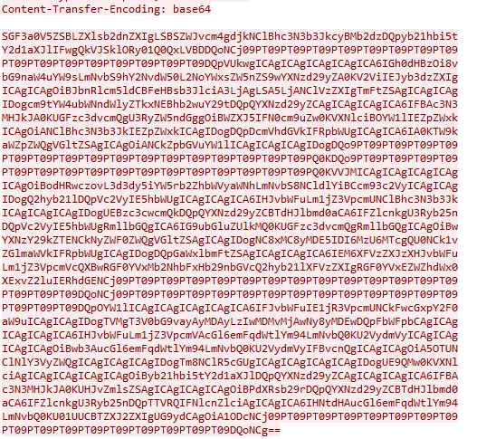

# HawkEye Walkthrough

## Cyberdefenders

**Scenario**
: An accountant at your organization received an email regarding an invoice with a download link. Suspicious network traffic was observed shortly after opening the email. As a SOC analyst, investigate the network trace and analyze exfiltration attempts.

### 1-How many packets does the capture have ?

To get “about information” from **Statistics > Capture File Properties** and look for Packets under Measurements.
**Packets = 4003**

### 2- At what time was the first packet captured?

First configure time as UTC from **View > Time Display Format > UTC Date and Time of Day.**
Then from No column see the first packet and from time column you find the time you seek
The first packet’s time 2019-04-10 20:37:07 UTC

### 3- What is the duration of the capture?

**Statistics > Capture File Properties** and look for Packets under Measurements.
**Elapsed = 01:03:41**

### 4- What is the most active computer at the link level?

To view Ethernet, go to **Statistics > Endpoints > Ethernet.**
Click Packets to sort the packets by descending.
**the most active computer 00:08:02:1c:47:ae**

### 5- Manufacturer of the NIC of the most active system at the link level?

In searchbar using key “eth.addr” to display all the traffic from the MAC address
**eth.addr==00:08:02:1c:47:ae**
expand source and you find your destination  
**The Manufacturer Hewlett-Packard**

### 6- Where is the headquarter of the company that manufactured the NIC of the most active computer at the link level?

Use Google search
The Teadquarter **Palo Alto**

### 7- The organization works with private addressing and netmask /24. How many computers in the organization are involved in the capture?

Statistics > Endpoints > ipv4.12  
There is 4 IPs but 10.4.10.255 is the Broadcast address
So we have 3 computers involved

### 8- What is the name of the most active computer at the network level?

Using the value “eth.addr”
**eth.addr==00:08:02:1c:47:ae && dhcp**
Select the first frame and expand Dynamic Host Configuration
Protocol and Option (12)
**The Name is BEIJING-5CD1-PC **

### 9- What is the IP of the organization's DNS server?

Enter dns in searchbar to get the dsn traffic in destination column you find server ip **(10.4.10.4)**

### 10 - What domain is the victim asking about in packet 204?

Go to packet 204 then Expanding the Domain Name System and Queries will show the domain that the victim is accessing.
**The domain name proforma-invoices.com**

### 11- What is the IP of the domain in the previous question?

in searchbar use “frame contains proforma-invoices.com”
and look at destination
**The ip is 217.182.138.150**

### 12- Indicate the country to which the IP in the previous section belongs.

Use “AbusedIPDB” to get information about the ip
**The ip is from France**

### 13 - What operating system does the victim's computer run? 

Use **“eth.addr==00:08:02:1c:47:ae && http.request”**
Select follow TCP for the first frame
That shows the HTTP request headers. The Operating System can identify from the User-Agent field
**O.S : Windows NT 6.1**

### 14 - What is the name of the malicious file downloaded by the accountant?

Expand hypertext transfer protocol then 1st option then 1st option
T**he file name “tkraw_Protected99.exe”**

### 15- What is the md5 hash of the downloaded file?

**File > Export Objects > HTTP.**
Then use the following python code to hash it

```python
import hashlib
md5_hash = hashlib. md5()
a_file = open("absolute pass ", "rb")
content = a_file. read()
md5_hash. update(content)
digest = md5_hash. hexdigest()
print(digest)
```

**The hashed is 71826ba081e303866ce2a2534491a2f7**

### 16 - What is the name of the malware according to Malwarebytes?

Use virus total and search the file
**The name Spyware.HawkEyeKeyLogger**

### 17 - What software runs the webserver that hosts the malware?

Repeat the steps in 13th part with field server
**Server name is LiteSpeed**

### 18 - What is the public IP of the victim's computer?

To add the Host column from the Column display, go to **Edit > Preferences > Appearance > Columns. Click the (+) button**

- In name column enter Host
- In type column choose custom
- In field column enter hhrrp.host
- Then OK button

In searchbar enter **http.requests**
The results from the filter above shows frame 3164 performed a GET request from the host bot.whatismyipaddress.com.

bot.whatismyipaddress.com is not accessible but if you access whatismyipaddress.com, it will display your device’s public IP address

Using the Follow HTTP Stream feature, the HTTP header shows the public IP address of the victim’s computer.

**The IP is 173.66.146.112**

### 19 - In which country is the email server to which the stolen information is sent?

In searchbar enter **ip.addr==10.4.10.132 && smtp.req**
That will show the Email Server’s IP address under Destination. AbuseIPDB shows the Country where the IP address is located.

**From : United States**

### 20 - What is the domain's creation date to which the information is exfiltrated?

Using same filter in 19th part then choose follow TCP option

In to field you find domain name
Then using terminal enter whois domain name
the results show the information of the domain including its creation date.
**the date is 2014-02-08**

### 21 - Analyzing the first extraction of information. What software runs the email server to which the stolen data is sent?

The same steps from the previous question on viewing the smtp traffic. The first line on the image below shows the software used and its version.
**Software is Exim 4.91**

### 22 - To which email account is the stolen information sent?

The same steps from 20th part on viewing the smtp traffic
**Email is sales.del@macwinlogistics.in**

### 23 - What is the password used by the malware to send the email?

This filter is used **“ip.addr == 10.4.10.132 && smtp.req”**

Selecting frame 3182 and expanding Application Layer/Simple Mail Transfer Protocol shows the password and it is encoded with base64.

**The password is : Sales@23**

### 24 - Which malware variant exfiltrated the data?

Using the Follow TCP stream option from one of the smtp requests, smtp traffic shows that the content is encoded with base64.



THE DECODED DATA  
: HawkEye Keylogger - Reborn v9
Passwords Logs
roman.mcguire \ BEIJING-5CD1-PC

: URL : https://login.aol.com/account/challenge/password
Web Browser : Internet Explorer 7.0 - 9.0
User Name : roman.mcguire914@aol.com
Password : P@ssw0rd$
Password Strength : Very Strong
User Name Field :
Password Field :
Created Time :
Modified Time :
Filename :

: URL : https://www.bankofamerica.com/
Web Browser : Chrome
User Name : roman.mcguire
Password : P@ssw0rd$
Password Strength : Very Strong
User Name Field : onlineId1
Password Field : passcode1
Created Time : 4/10/2019 2:35:17 AM
Modified Time :
Filename : C:\Users\roman.mcguire\AppData\Local\Google\Chrome\User Data\Default\Login Data

: Name : Roman McGuire
Application : MS Outlook 2002/2003/2007/2010
Email : roman.mcguire@pizzajukebox.com
Server : pop.pizzajukebox.com
Server Port : 995
Secured : No
Type : POP3
User : roman.mcguire
Password : P@ssw0rd$
Profile : Outlook
Password Strength : Very Strong
SMTP Server : smtp.pizzajukebox.com
SMTP Server Port : 587

**The decoded is Reborn v9**

### 25 - What are the bankofamerica access credentials? (username:password)

from the previous data
**The user name and password are : roman.mcguire:P@ssw0rd$**

### 26 - Every how many minutes does the collected data get exfiltrated?

Entering smtp on the filter field to display only the smtp traffic. Providing some of the traffic when the email content (email headers + body) was sent, it shows that it was sent every 10 minutes

### Tools used :

- **Wire Shark**

#### Written by

# *Karim Gomaa*
